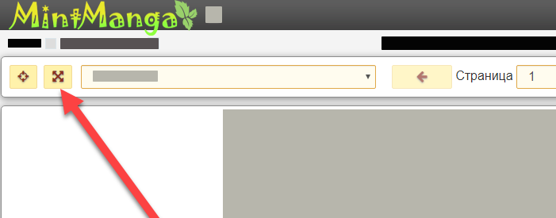

Все элементы контроля сохраняются (клик по картинке перейдёт к следующей). Поддерживается прокрутка в нативном режиме, если смотреть в оригинальном размере, и разрешение картинки окажется больше, чем у вашего экрана.

1) Установите Tampermonkey для вашего браузера:

- For Chrome - https://chrome.google.com/webstore/detail/tampermonkey/dhdgffkkebhmkfjojejmpbldmpobfkfo?hl=ru;

- For Firefox -  https://addons.mozilla.org/ru/firefox/addon/tampermonkey/;

- For Opera - https://addons.opera.com/ru/extensions/details/tampermonkey-beta/;

- For Safari - https://safari-extensions.apple.com/details/?id=net.tampermonkey.safari-G3XV72R5TC

2) Откройте ссылку скрипта: https://github.com/xonrsoftware/FullscreenOptionForMintManga/raw/master/script.user.js и нажмите "Install";

